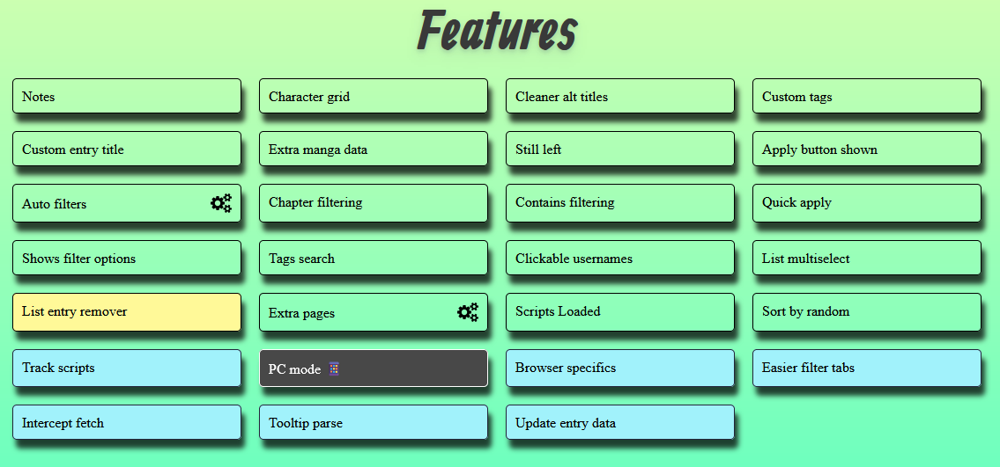
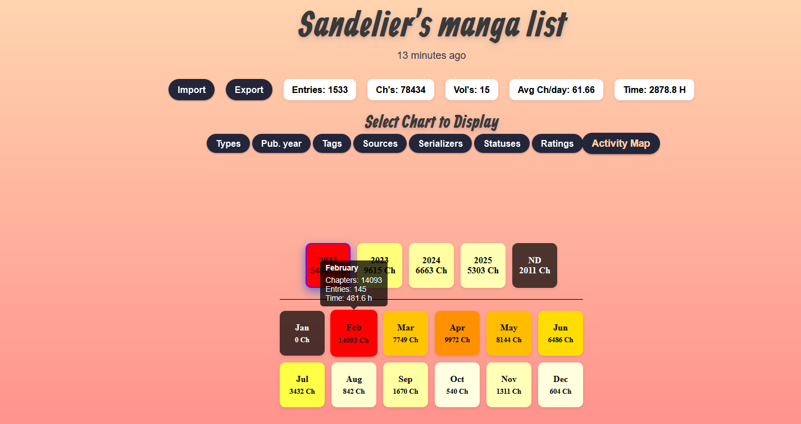

# AnimePlanet Additions
Adding new features / fixing minor inconveniences that i've found in AnimePlanet.
Includes small list visualizer, but there's an button to export the data so you can make an better one if you want to.

Gonna add chromium someday. (Don't trust me on this one) 

## Installation

**Permissions:**
- You need to allow the extension to operate in Animeplanet's url so that we can inject content scripts.
- If you want to use the "Extra manga data" script then you need to also allow the extension to operate in mangaupdates api url.

### Firefox
Extension can be found in Mozilla's add-on page: [AnimePlanet Additions](https://addons.mozilla.org/en-US/firefox/addon/animeplanet-additions/)

### Options page
You can enable/disable features on the options page of the addon. You can access it through clicking the popup

### Acknowledgements
* **Mangaupdates** ([https://api.mangaupdates.com/](https://api.mangaupdates.com/)): Mangaupdates api is used for "Extra manga data" feature to fetch manga data
* **Chart.js** ([https://www.chartjs.org/](https://www.chartjs.org/)): Chart.js is used to make charts lot easier in option page.

## License

This project is licensed under the MIT License. See the [LICENSE](LICENSE) file for details.
